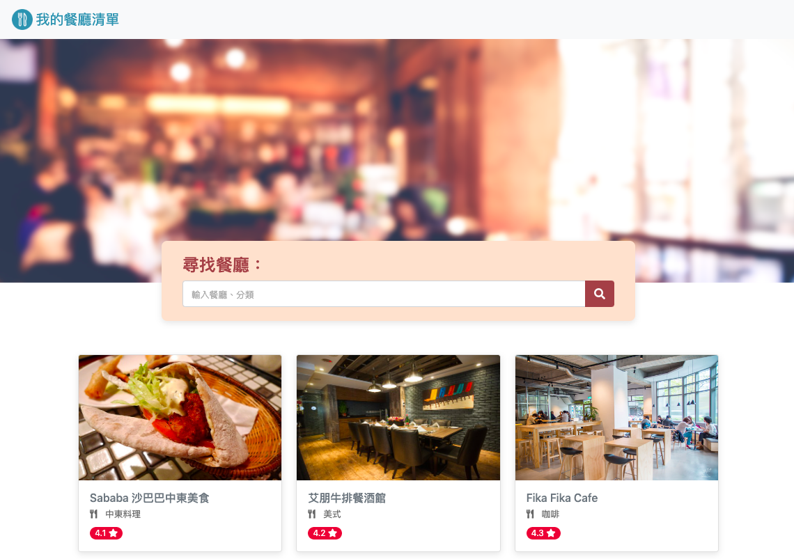

# Introduction
This is my restaurant list, showing all the restaurants I like, details and providing search function.



## Features

- Browse all the restaurants
- Check the specific restaurant details
- Link restaurant address to Google map
- Search for specific restaurant

## Start to use

1. Install node.js & npm first

2. Clone this project to localhost
```
git clone  https://github.com/YuZih/Restaurant-List.git
```

3. Enter the project folder through terminal, and then install npm package by inputting the command below

```
npm install
```

4. After npm is installed, input the command below

```
npm run start
```

5. Operation success if the following message shows, and then type http://localhost:3000 in the browser

```
Express is listening on http://localhost:3000
```

6. Type the command below to stop operation

```
ctrl + c
```


## Development tools

- Node.js
- Express
- Express-Handlebars
- Bootstrap
